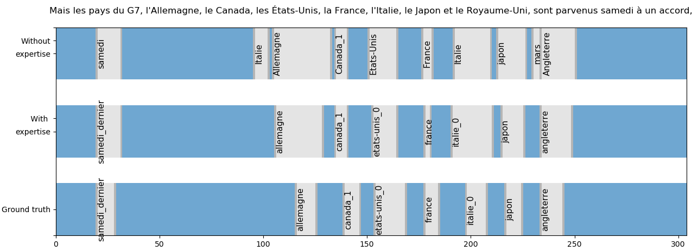

# Annotation of LSF subtitled videos without a pre-existing dictionary (LREC-Coling Workshop 2024)

This repository is the official implementation of **Annotation of LSF subtitled videos without a pre-existing dictionary** (coming soon!).  
The aim of our current project is to contribute in developing resources and automatic analysis of LSF videos.  
We propose a three stages approach for the automatic annotation of lexical units in LSF videos, using a subtitled corpus without annotation.  

### [Step 1 : weakly supervised segmentation of specific signs in the videos, without use of any isolated example](Step1_Weakly_supervised_annotation)

### Step 2 : expert reviewing of the segmented signs.
- Define the quality level of each sign.
- Identify the variants that were not clustered during Step 1 (as for friday)
 
 
### [Step 3 : supervised classification](Step3_supervised_classification)

The figure below is a comparison between the predictions of 2 classifiers which have been trained with automatic annotated data previously checked by non-experts (top) and experts (middle), and a ground truth (bottom) on a test video with the subtitle : "But the G7 countries -
Canada, France, Germany, Italy, Japan, the United Kingdom and the United States - reached an agreement on Saturday"

 

### Videos encoding
In steps 1 and 3, we used features extracted from a Video Swin Transformer trained on BSL data.  
Pre-trained model is available [here](https://github.com/prajwalkr/transpeller).  

### Mediapi-RGB Corpus
[Link to Mediapi-rgb Corpus (including Swin Video features)](https://www.ortolang.fr/market/corpora/mediapi-rgb/)  

