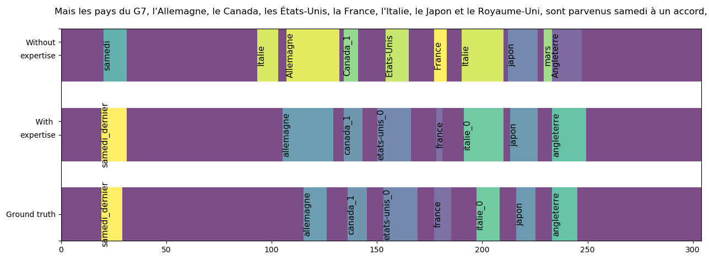

# Annotation of LSF subtitled videos
 
The aim of our current projects is to contribute in developing resources and automatic analysis of LSF videos, and more specifically the automatic annotation of lexical units in a continuous video, also called Sign Spotting.  
We propose an approach that takes advantage of the skills of linguists associated with machine learning methods.    

Step 1 : weakly supervised segmentation of specific signs in the videos, without use of any isolated example.  
Step 2 : expert reviewing of the segmented signs.  
Step 3 : supervised classification.  

The figuren below is a comparison between the predictions of the non-expert (top), the expert (middle) classifiers
and a ground truth (bottom) on a test video in a video with the subtitle : "But the G7 countries -
Canada, France, Germany, Italy, Japan, the United Kingdom and the United States - reached an agreement on Saturday"

Coming soon :  
- Step 1
- link to get Mediapi Swin Video features  
- link to our paper