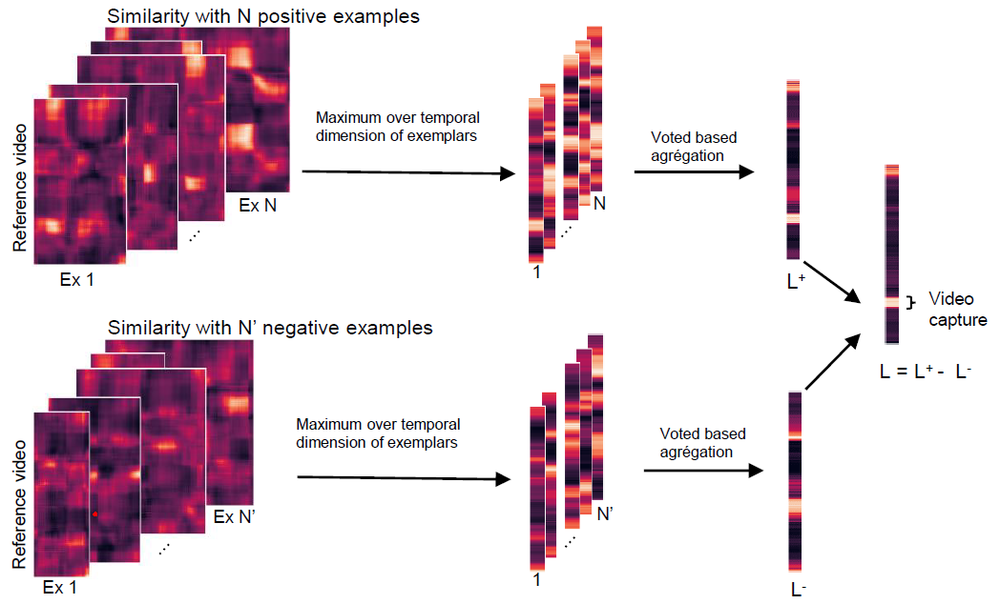

# Step1_Weakly_supervised_annotation
In this section, we construct a dictionary of signs captured from continuous subtitled videos of Mediapi-rgb Dataset. 

This method is based on similarity calculation as explained in the paper [to do: add the link], and its general principle is summarized in the figure below.

**Detecting unknown signs by spotting through exemplars.**
-----------------------

