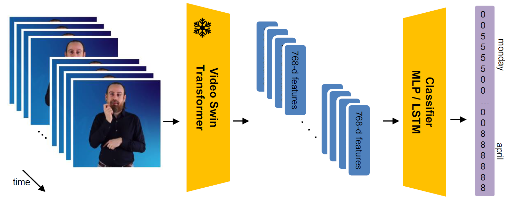

# Step3_supervised_annotation
During the first step, we built a French-LSF lexicon which was reviewed or not by linguists (step 2), enabling us to annotate a portion of the data to train a classifier.  
The system architecture is illustrated in the figure below :  
- The first model extracts video features using a [Video Swin Transformer trained on BSL data](https://github.com/prajwalkr/transpeller)
- The second model is a lightweight straight-forward MLP classifier. It takes the features as input and produces sequences of integers as output. Each integer in the output sequence identifies the class corresponding to each frame.

### 1. Prepare data for training
scripts in [**Prepare_data** ](Prepare_data)
### 2. Train models, evaluate them and visualize predictions
scripts in [**src**](src)  
